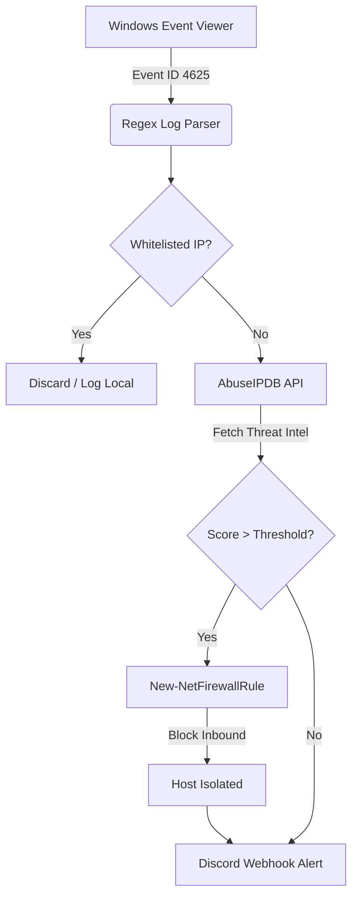

<div align="center">
  <h1>🛡️ SentinelTrap</h1>
  <p><b>Automated Endpoint Detection & Active Response (EDR) for Windows</b></p>

  [](https://microsoft.com/powershell)
  [](https://microsoft.com/windows)
  [](https://opensource.org/licenses/MIT)
  [](#)
</div>

---

## 📌 Executive Summary
**SentinelTrap** is a lightweight, host-based Intrusion Prevention System (HIPS) engineered to detect, enrich, and remediate authentication-based attacks (e.g., RDP/SMB brute-force) in real-time. 

Traditional SOC environments suffer from high Mean Time To Respond (MTTR) due to manual log triaging. SentinelTrap automates the entire incident lifecycle at the endpoint level: ingesting Windows Event Logs, executing OSINT lookups via AbuseIPDB, dynamically isolating the threat actor via Windows Defender Firewall, and dispatching formatted telemetry to SOC communication channels.

## ⚙️ Architecture & Data Flow

The core engine operates on a continuous loop, leveraging native Windows APIs for minimal resource footprint.



## 🚀 Key Capabilities
* **Native Telemetry Ingestion:** Direct parsing of the Windows Security Event Log (`Event ID 4625`) without requiring third-party agents.
* **Strict Heuristic Filtering:** Implements advanced Regex patterns to validate IPv4/IPv6 addresses, drastically reducing false positives caused by malformed Windows logging behaviors.
* **Automated Threat Intelligence:** Real-time IP reputation lookups against the global AbuseIPDB database.
* **Dynamic Containment:** Programmatic injection of permanent inbound block rules directly into the Windows Firewall.
* **Fail-Safe Mechanisms:** Built-in whitelisting for loopback addresses (`127.0.0.1`, `::1`) to prevent self-imposed Denial of Service (DoS).
* **Real-Time SOC Alerting:** Dispatches structured JSON payloads to Webhooks (Discord/Slack) containing attacker IP, Abuse Confidence Score, and remediation status.

## 🛠️ Deployment Guide

### Prerequisites
* **OS:** Windows 10/11 or Windows Server (2016+).
* **Privileges:** Must be executed in an elevated context (Run as Administrator) to modify Firewall rules.
* **API:** An active [AbuseIPDB API Key](https://www.abuseipdb.com/).

### Installation
1. Clone the repository to your designated security tools directory:
   ```bash
   git clone [https://github.com/ArmSec7/SentinelTrap.git](https://github.com/ArmSec7/SentinelTrap.git)
   ```
2. Enable Windows Logon Failure Auditing (Required for Event ID 4625 generation):
   ```cmd
   auditpol /set /subcategory:"Logon" /failure:enable
   ```
3. Open `SentinelTrap.ps1` and inject your API Keys into the configuration block:
   ```powershell
   $API_KEY = "YOUR_ABUSEIPDB_KEY"
   $DISCORD_WEBHOOK = "YOUR_WEBHOOK_URL"
   ```

### Execution
Initiate the active monitoring engine by bypassing the local execution policy for the current process:
```powershell
powershell -ExecutionPolicy Bypass -File .\SentinelTrap.ps1
```

## ⚠️ Security & Operational Disclaimer
* **Credential Hygiene:** Never commit your operational API keys or Webhook URLs to public repositories.
* **Production Deployment:** This script aggressively alters network access controls. It is highly recommended to test this logic in a controlled homelab or staging environment before deploying to production domains.
* **Scope:** Designed as a PoC for SOC automation and endpoint active defense.

---
*Developed for SOC Operations and Endpoint Security Architecture.*
```

